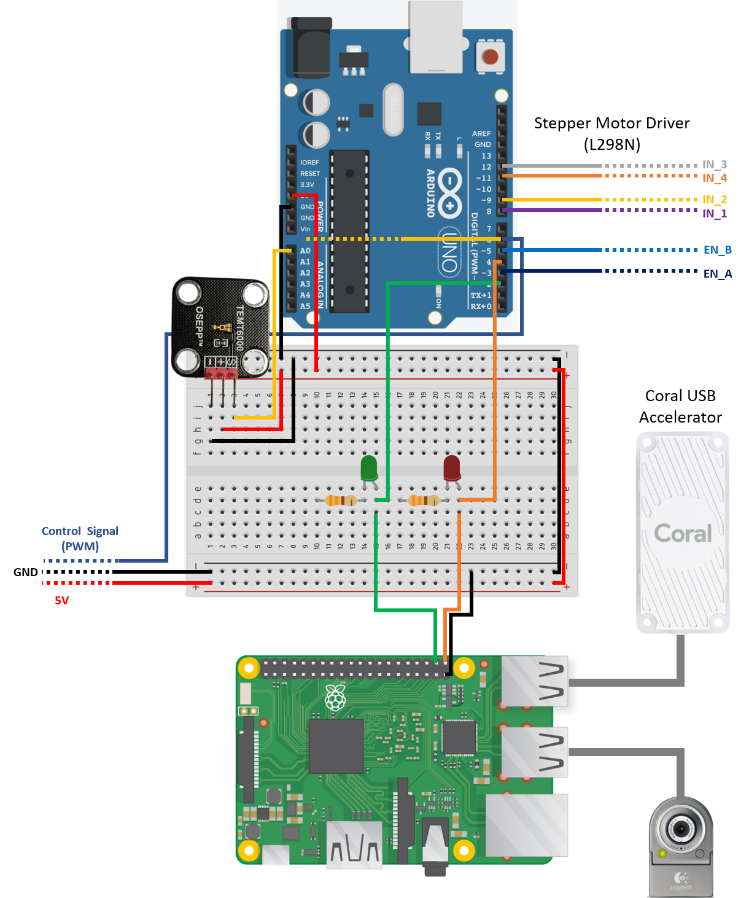

# coral-webcam-detection
Edge TPU real-time face detection and tracking on a Raspberry Pi with a Google Coral USB Accelerator and USB webcam

### Hardware:
1. Raspberry Pi 3 Model B+
2. Google Coral USB Accelerator
3. Arduino Uno (optional: for GPIO output)
4. Logitech webcam
5. Osepp TEMT6000 Ambient Light Sensor 

### Summary
I mostly followed the tutorial [here](https://www.pyimagesearch.com/2019/05/13/object-detection-and-image-classification-with-google-coral-usb-accelerator/) for the real-time face detection. I then modified the code to use the GPIO ports of the Raspberry Pi 3 Model B+ in order to send digital output signals to an Arduino Uno whenever a face moved to the edge of the webcam view. The Arduino used these signals to activate a stepper motor that rotates the webcam to follow the detected face.

### Circuit Diagram

### References
1. Tutorial 1: https://www.pyimagesearch.com/2019/05/13/object-detection-and-image-classification-with-google-coral-usb-accelerator/), 
2. Tutorial 2: https://www.pyimagesearch.com/2019/04/22/getting-started-with-google-corals-tpu-usb-accelerator/
3. Pre-trained Model: http://storage.googleapis.com/cloud-iot-edge-pretrained-models/canned_models/mobilenet_ssd_v2_face_quant_postprocess_edgetpu.tflite

